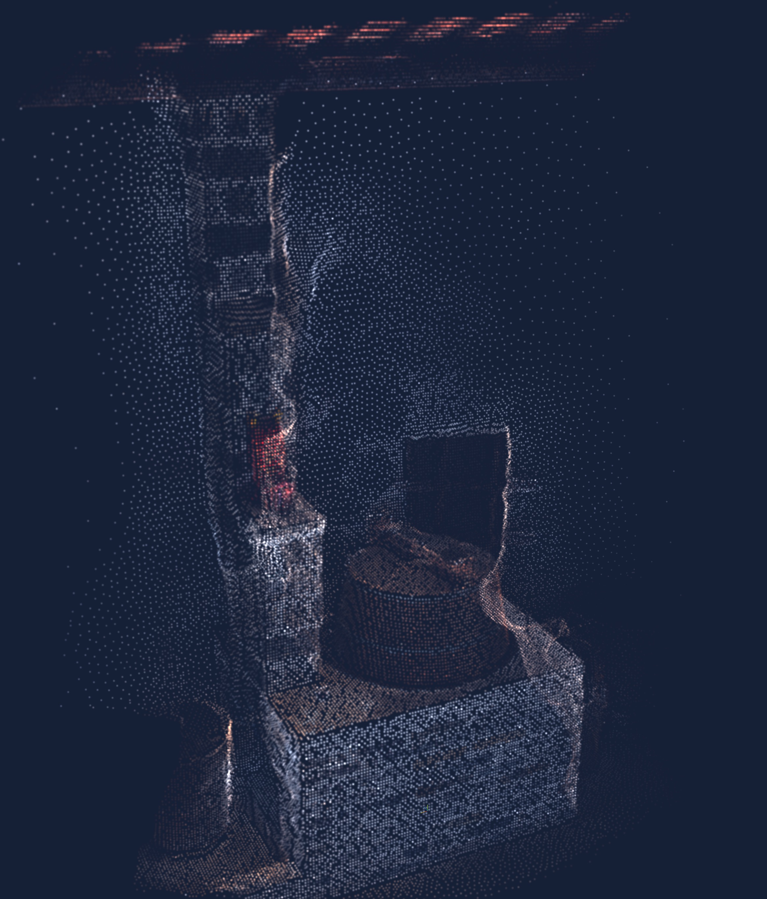

# Import particles positions and colours from png files
Decode the position.png and color.png and create the particles in ThreeJS.

This [Houdini](/Users/bellergy/Documents/3D_Design/houdini/samples/bake/bake_attributes_to_png/bake_attributes_to_png.hiplc) file can bakes particles data to PNG files.

## Setup
``` bash
# Develop and run on node v17.7.1
# Run the `nvm` if need:
nvm use v17.7.1

# Install dependencies (only the first time)
npm install

# Run the local server at http://localhost:8080
# Debug mode: http://localhost:8080#debug
npm run dev

# Build for production in the dist/ directory
npm run build
```

## Preview
